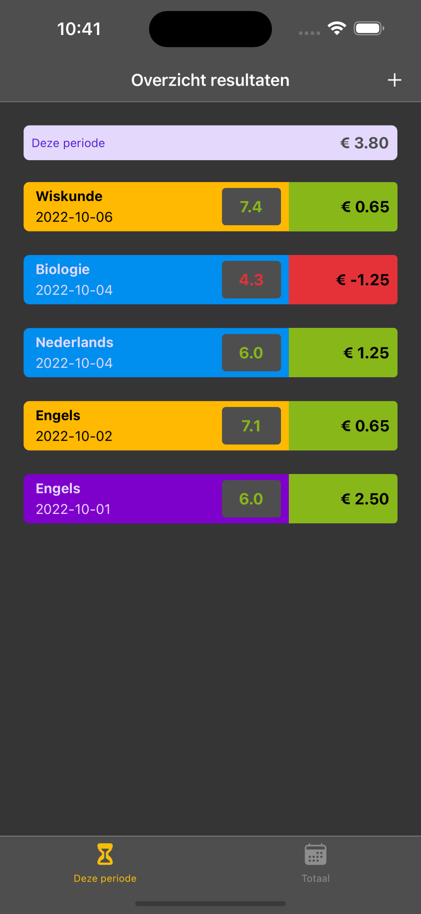

### REACT NATIVE APP

## Continuous deployment

App lives [here](https://sashas-results-tracker.netlify.app/).

## Issues
- ✅ fix update profile
- ✅ fix icons!!! 
- firebase rules setup
- stay loggedin with refresh token
- open login screen after reload/reopen app in stead of recent results

## To-do list
- try catch, alert error everywhere
- ✅ refactor getUser and local storage
- maximize pic upload size
- maximize device with css
- Button choose
- cleanup
- courses inputs
- redirect from signup to loggedin with fetching userdata

## Wish List
- parent role
- nice currentSaldo interface
- app-icon
- statistics
- amount inputs

## Dependencies issues
- react-native-reanimated": "^2.5.0" <= important for happy 'web' and 'ios' versions

